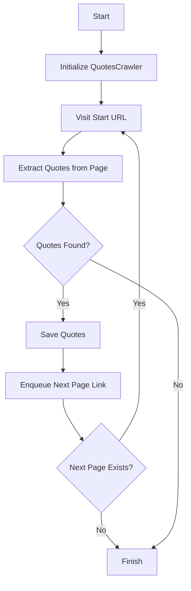

# Detailed Explanation of `scrapperv1.py`

## Overview

This script is a web crawler that scrapes quotes from [quotes.toscrape.com](http://quotes.toscrape.com/) using the Crawlee framework and BeautifulSoup for HTML parsing. It extracts quotes, authors, and tags from each page, saves the data, and follows pagination links to scrape multiple pages.

---

## Key Components

### 1. Imports and Logging

- Imports `asyncio` for async execution, `logging` for status messages, `typing` for type hints, and Crawlee modules for crawling and storage.
- Configures logging to show INFO-level logs.

### 2. QuotesCrawler Class

- Inherits from `BeautifulSoupCrawler`.
- Initializes a counter for scraped items.
- The `request_handler` method is called for each page:
  - Logs the current page.
  - Extracts all quotes, authors, and tags using BeautifulSoup selectors.
  - Saves extracted data if found, increments the counter, and logs warnings if data is incomplete.
  - Enqueues the "Next" page link for further crawling.

### 3. Main Function

- Configures the crawler with a start URL and a limit of 10 pages.
- Runs the crawler asynchronously, prints progress, and shows where data is saved.

### 4. Script Entry Point

- Runs the main function if the script is executed directly.

---

## Mermaid Diagram: Crawler Flow

---

## Summary

- The script crawls and extracts quotes, authors, and tags from up to 10 pages.
- Data is saved in the default storage location.
- The code is modular and uses async programming for efficiency.